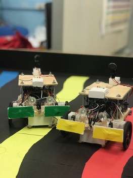
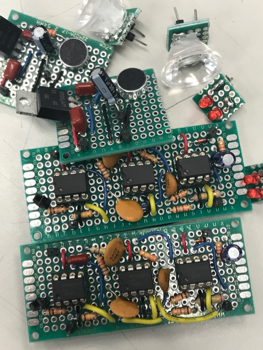
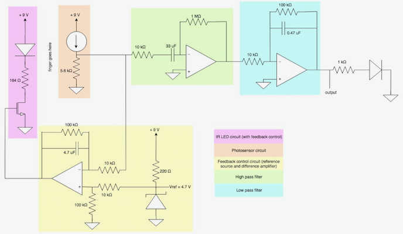
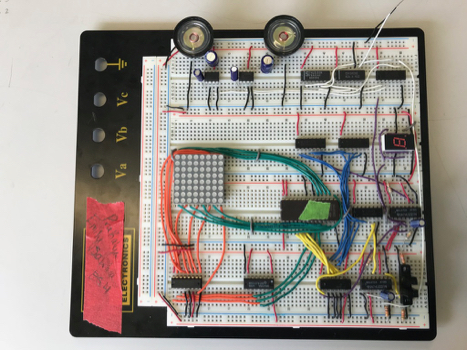
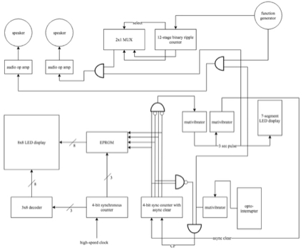

# Projects

## Swarmbots

[_Left_] _Tatyana and Nadia_

[_Right_] _Filter/amplification and microphone circuits_

Modeled and simulated the navigation and environmental sensing of autonomous vehicles by designing a swarmbot team consisting of a community of two robots. Designed and implemented circuits for colored path detection, sending and receiving messages, collision detection, motor control. Signals from the hand-soldered circuits were sent to an Arduino, which had various sets of code to complete challenges.

## Pulse Oximeter

 _Pulse oximeter schematic_ 

Built and tested a circuit that read a patient’s pulse. An infrared LED shone through a patient’s finger, with a photosensor on the opposite side of the IR LED that responded according to how much IR light was absorbed by the blood in the patient’s finger. This sensor voltage was passed through a bandpass filter with a gain of ≈ 60 dB to filter out DC signals and higher frequency noise. Feedback control was included (to correct for patient finger size) by reducing the light emitted from the IR LED when a smaller finger was in the detector. The current flow through the IR LED was reduced using an NMOS transistor. The transistor’s gate was connected to the output of a differential amplifier, which took the difference between the DC signal from the photodetector and a reference voltage of 4.7 V, and amplified that difference with a gain of 10 V/V. The reference voltage was generated using a zener diode in breakdown. The differential amplifier also acted as a low pass filter (capacitor in parallel with op amp’s feedback resistor). Its purpose was to compare the DC signal from the photodetector, so it needed to filter out the pulse signal in order to work properly. 

## Vending Machine Computer

 

 [_Top_] _Physical implementation_ 

 [_Bottom_] _Block diagram_ 

Designed, simulated, built, and tested a circuit that modeled a vending machine. The circuit "accepted" quarters, meaning every time a piece of paper or something similar was placed in a sensor (opto-interrupter), a LED display indicating how much change had been put in the machine increased by 25. The machine “dispensed” a soda when the amount deposited was equal to $2.50. When this happened, a seven-segment display had to display a “U”, and after three seconds, the circuit had to reset back to its initial state. Every time a quarter was put into the machine, a tone had to be played and when the soda was dispensed, a melody had to play. If the deposited money was more than $2.50, a change indicator light had to light up (up to $0.50 change - this was represented by a negative sign). 

## MATLAB Tuner

<iframe width="560" height="315" src="https://www.youtube.com/embed/U-JsfQian4s" frameborder="0" allow="accelerometer; autoplay; encrypted-media; gyroscope; picture-in-picture" allowfullscreen></iframe>

 _Video of tuner in action_ 

Designed and coded a device using MATLAB to determine a sampled note pitch compared to a tuning note (A at 440 Hz). Fourier analysis converts a signal from its original domain (in this case, time) to a representation in the frequency domain. Since the fundamental harmonic is the lowest harmonic associated with a given pitch, the first peak in a FFT of an audio input is associated with the fundamental frequency. This fundamental frequency was compared to actual note frequencies to determine which pitch it was closest to, then plotted on a graph as compared to the actual note pitch. The tuner also played ideal note pitches (pure sine waves at the correct frequencies) and saved the most recent note progression.
